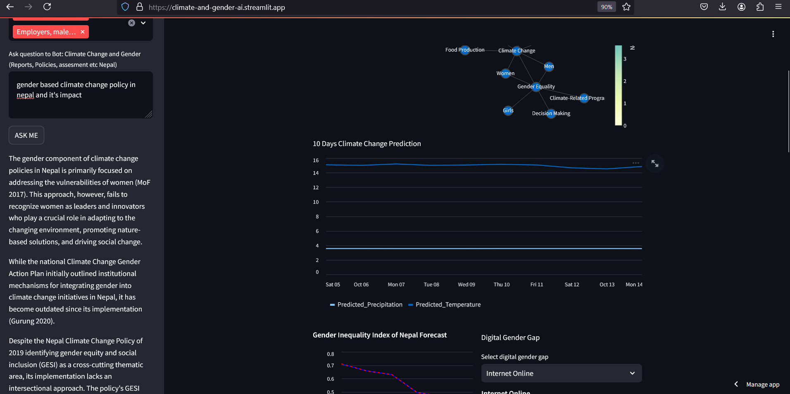

# Background
The United Nations Sustainable Development Goals (SDGs), highlight two critical global issues: the persistent gender inequalities and the increasing threats posed by climate change. 

_Globally, Nepal is ranked fourth in terms of vulnerability to climate change. Floods spread across the foothills of the Himalayas and bring landslides, leaving tens of thousands of houses and vast areas of farmland and roads destroyed. - Wikipedia_

Addressing this issue is a key focus of the United Nations Sustainable Development Goals (SDGs), specifically SDG 5 (Gender Equality) and SDG 13 (Climate Action). Understanding how climate change affects gender inequalities and vice versa is critical to formulating policies that promote resilience and gender equity in climate adaptation strategies.
This project proposes a data-driven approach that allow us to model the relationship between climate change and gender inequality by leveraging structured and unstructured data sources, including reports, publications, and climate/gender datasets.

# Objectives

1. AI-Driven Report Generation and Policy Recommendations
Utilize AI agents to process real-time climate and gender-related data, generating comprehensive reports. These reports will provide data-driven insights and policy recommendations that address both challenges simultaneously.

2. Climate-Resilient Infrastructure Development
Apply AI to analyze environmental trends like temperature changes and precipitation. This data will guide the development of climate-resilient infrastructure, focusing on predicting and mitigating flood risks to protect vulnerable communities and ensure equitable access to essential resources.

3. Risk Assessment and Early Warning Systems
Develop a predictive models using climate data to identify regions at heightened risk for disasters such as floods, droughts, and landslide. These models will inform early warning systems.

4. Advanced Climate-Related Disaster Mapping and Mitigation
Utilize NASA's Earthdata with AI-driven mapping to predict climate disasters like floods and landslides, improving risk assessments and guiding targeted mitigation efforts for vulnerable, climate-affected communities.

# chat feature

# Explain Graph Features
user can click on Explain Graph, which will explain the relation of graph in natural language

# Climate Change Indicator

# Gender Statistics

# Methodology
- Data Collection
    - Gender Inequality Data: Data on gender gaps in education, health, employment, and political participation etc will be collected from various sources. 
- Climate Change Data: Climate data from sources such as https://power.larc.nasa.gov   
- Policy Documents, Reports, Journals: Relevant reports, research papers and documents that highlight the gendered impacts of climate change.

# AI Agents
AI agents will analyze climate metrics( temperature,precipitation), gender gaps( education, employment, digital etc), and climate indicators (Forest ,Carbon, Climate Related Disasters etc), alongside policy documents, reports, and publications to generate a comprehensive reports. It will identify the intersectionality between gender and climate issues, uncovering patterns and insights to inform strategies for promoting gender equality and effective climate action.

# Ethical Considerations
- Bias and Fairness: Ensure that machine learning models are not biased against marginalized gender groups. 
- Data Privacy: Safeguard the privacy of individuals and communities when collecting and processing gender-disaggregated data.

# License
MIT License

# Python
- Python 3.11.6 

