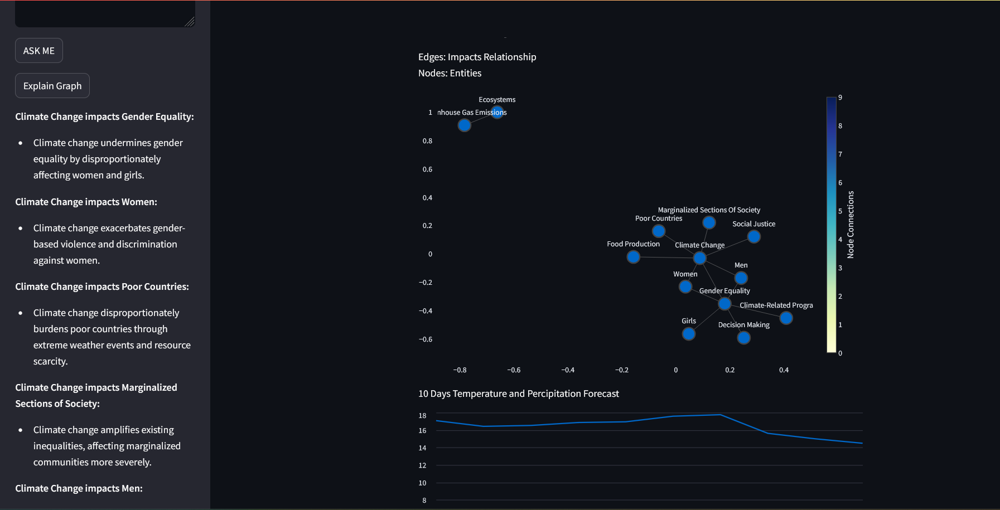

# Background
The United Nations Sustainable Development Goals (SDGs), highlight two critical global issues: the persistent gender inequalities and the increasing threats posed by climate change. While these issues are often examined independently, they intersect in many ways. Climate change exacerbates gender disparities, particularly in marginalized communities, where women, girls, and gender minorities face heightened vulnerability during environmental crises.

For example, natural disasters disproportionately impact women’s livelihoods, education, health, and personal safety. Women in rural and agricultural communities often bear the brunt of climate change-induced disruptions, such as droughts and floods, that intensify poverty and reduce access to resources.
Addressing this issue is a key focus of the United Nations Sustainable Development Goals (SDGs), specifically SDG 5 (Gender Equality) and SDG 13 (Climate Action). Understanding how climate change affects gender inequalities and vice versa is critical to formulating policies that promote resilience and gender equity in climate adaptation strategies.

This project proposes a data-driven approach using a combination of Knowledge Graphs, Large Language Models (LLMs), and Traditional Machine Learning techniques. This hybrid approach will allow us to model the relationship between climate change and gender inequality by leveraging structured and unstructured data sources, including reports, publications, and climate datasets.

# Objectives
- Policy Effectiveness: Evaluate the effectiveness of policies aimed at mitigating climate change and promoting gender equality.

- Climate-Resilient Infrastructure Development: Based on the trends of the features, infrastructure improvements (e.g., flood-resistant housing, drought-resistant agriculture) could focus on reducing the disproportionate burden on women by improving access to critical resources.

- Resource Allocation and Disaster Relief: Understanding the local climate dynamics (temperature, precipitation, wind) helps allocate resources to vulnerable populations, with specific attention to the needs of women and marginalized communities (e.g., ensuring gender-sensitive distribution of aid post-disaster).

- Risk Assessment and Early Warning Systems: These climate features can be used to develop predictive models that highlight areas at higher risk for disasters such as floods, droughts, and heatwaves. Policy measures can be directed to these regions to ensure gender-sensitive disaster preparedness plans.

# Screenshot

# chat feature

# Explain Graph Features
user can click on Explain Graph, which will explain the relation of graph in natural language

# Time series forecast

## Digital Gender Gap and Gender Inequality Index

# License
MIT License

# Python
- Python 3.11.6 

