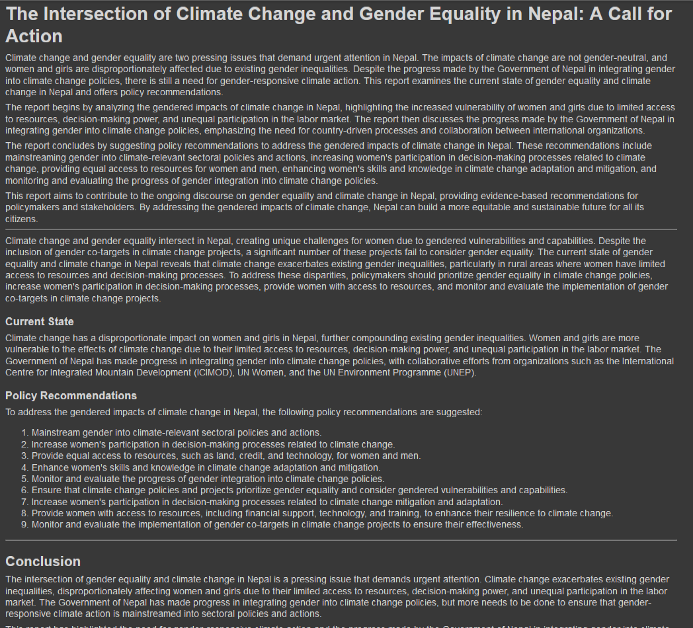

# Background
The United Nations Sustainable Development Goals (SDGs), highlight two critical global issues: the persistent gender inequalities and the increasing threats posed by climate change. While these issues are often examined independently, they intersect in many ways. Climate change exacerbates gender disparities, particularly in marginalized communities, where women, girls, and gender minorities face heightened vulnerability during environmental crises.

For example, natural disasters disproportionately impact women’s livelihoods, education, health, and personal safety. Women in rural and agricultural communities often bear the brunt of climate change-induced disruptions, such as droughts and floods, that intensify poverty and reduce access to resources.
Addressing this issue is a key focus of the United Nations Sustainable Development Goals (SDGs), specifically SDG 5 (Gender Equality) and SDG 13 (Climate Action). Understanding how climate change affects gender inequalities and vice versa is critical to formulating policies that promote resilience and gender equity in climate adaptation strategies.

This project proposes a data-driven approach using a combination of Knowledge Graphs, Large Language Models (LLMs), and Traditional Machine Learning techniques. This hybrid approach will allow us to model the relationship between climate change and gender inequality by leveraging structured and unstructured data sources, including reports, publications, and climate datasets.

# Objectives

1. AI-Driven Report Generation and Policy Recommendations:
Utilize AI agents to process real-time climate and gender-related data, generating comprehensive reports. These reports will provide data-driven insights and policy recommendations that address both challenges simultaneously.

2. Climate-Resilient Infrastructure Development:
Apply AI to analyze environmental trends like temperature changes and precipitation. This data will guide the development of climate-resilient infrastructure, focusing on predicting and mitigating flood risks to protect vulnerable communities and ensure equitable access to essential resources.

3. Risk Assessment and Early Warning Systems:
Develop a predictive models using climate data to identify regions at heightened risk for disasters such as floods, droughts, and landslide. These models will inform early warning systems.

# chat feature

# Explain Graph Features
user can click on Explain Graph, which will explain the relation of graph in natural language

# Climate Change Indicator 

# Gender Inequality Index

# Methodology
- Data Collection
    - Gender Inequality Data: Data on gender gaps in education, health, employment, and political participation etc will be collected from various sources. 
- Climate Change Data: Climate data from sources such as https://power.larc.nasa.gov   
- Policy Documents, Reports, Journals: Relevant reports, research papers and documents that highlight the gendered impacts of climate change.

# Ethical Considerations
- Bias and Fairness: Ensure that machine learning models are not biased against marginalized gender groups. 
- Data Privacy: Safeguard the privacy of individuals and communities when collecting and processing gender-disaggregated data.

# Carbon Emission From AI Technology
Raising awareness and addressing the carbon emissions of AI technologies like Stable Diffusion and Large Language Models (LLMs) is crucial. Here are some steps:
1. Optimize Cloud Usage: Choose cloud providers that prioritize renewable energy and have robust sustainability practices. Providers like Google Cloud and Microsoft Azure offer carbon-neutral options.

2. Adopt Green AI Practices: Implement energy-efficient algorithms and optimize model architectures to reduce energy consumption. Tools like LLMCarbon can help estimate and manage the carbon footprint of AI models.

3. Efficient Model Training: Use techniques such as model pruning, QLoRA(Fine-Tuning LLM), and knowledge distillation to reduce the computational load and energy consumption during training.

# License
MIT License
contact: utkarsha.khanal@gmail.com

# Python
- Python 3.11.6 

