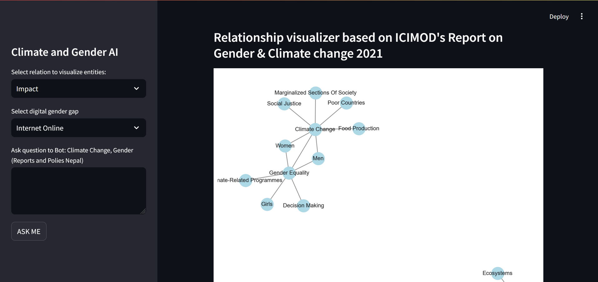
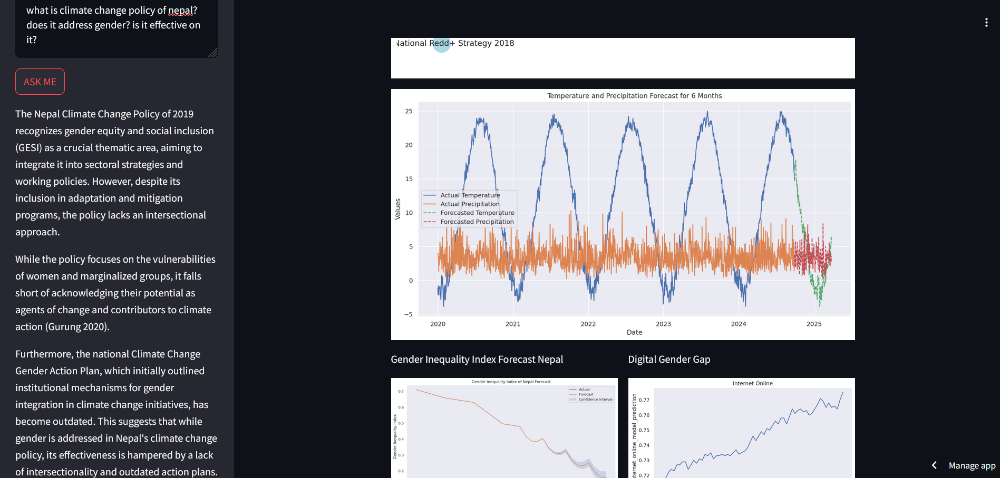
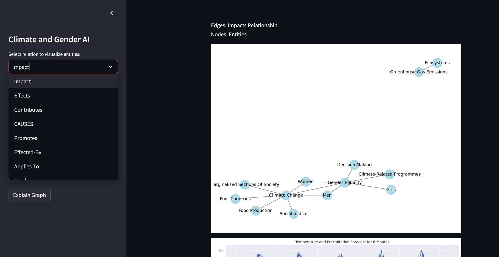

# Background
The United Nations Sustainable Development Goals (SDGs), highlight two critical global issues: the persistent gender inequalities and the increasing threats posed by climate change. While these issues are often examined independently, they intersect in many ways. Climate change exacerbates gender disparities, particularly in marginalized communities, where women, girls, and gender minorities face heightened vulnerability during environmental crises.

For example, natural disasters disproportionately impact women’s livelihoods, education, health, and personal safety. Women in rural and agricultural communities often bear the brunt of climate change-induced disruptions, such as droughts and floods, that intensify poverty and reduce access to resources.
Addressing this issue is a key focus of the United Nations Sustainable Development Goals (SDGs), specifically SDG 5 (Gender Equality) and SDG 13 (Climate Action). Understanding how climate change affects gender inequalities and vice versa is critical to formulating policies that promote resilience and gender equity in climate adaptation strategies.

This project proposes a data-driven approach using a combination of Knowledge Graphs, Large Language Models (LLMs), and Traditional Machine Learning techniques. This hybrid approach will allow us to model the relationship between climate change and gender inequality by leveraging structured and unstructured data sources, including reports, publications, and climate datasets.

# Objectives
The main objectives of this project are:
- Developing a Knowledge Graph: Create a gender-climate knowledge graph that maps the intricate relationships between climate change impacts, gender disparities, and socio-economic factors across various regions and sectors.
- Applying Machine Learning: Leverage ML algorithms to analyze patterns and predict gender-specific outcomes from climate change scenarios (e.g., the effect of droughts on female labor force participation).
- Building Tools: Create a dashboard or AI-powered decision-making tool.

# Screenshot

# chatbot feature

