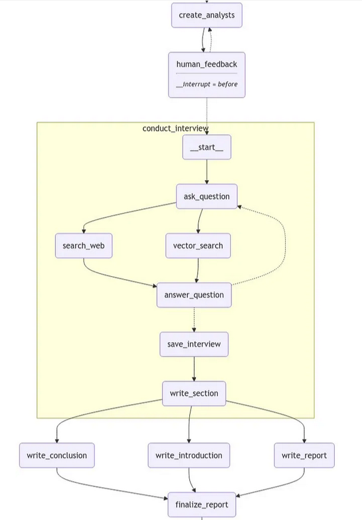
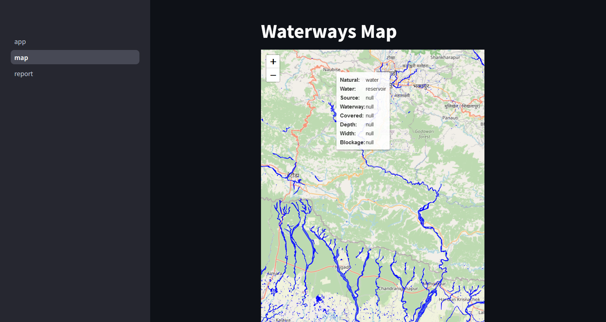
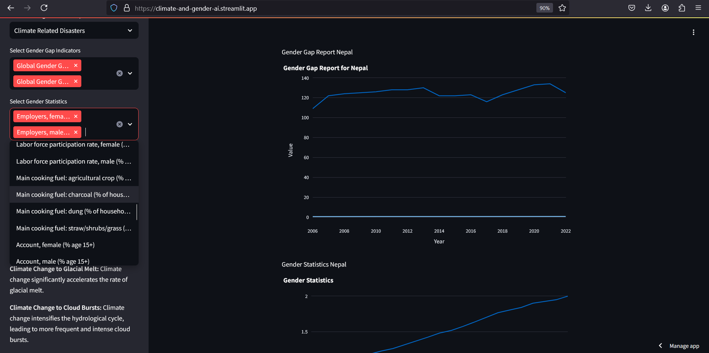
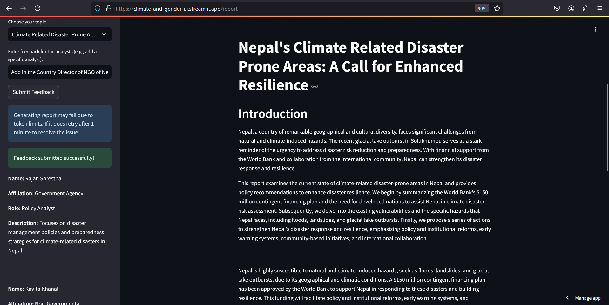

# Background
The United Nations Sustainable Development Goals (SDGs), highlight two critical global issues: the persistent gender inequalities and the increasing threats posed by climate change. 

_Globally, Nepal is ranked fourth in terms of vulnerability to climate change. Floods spread across the foothills of the Himalayas and bring landslides, leaving tens of thousands of houses and vast areas of farmland and roads destroyed. - Wikipedia_

Addressing this issue is a key focus of the United Nations Sustainable Development Goals (SDGs), specifically SDG 5 (Gender Equality) and SDG 13 (Climate Action). Understanding how climate change affects gender inequalities and vice versa is critical to formulating policies that promote resilience and gender equity in climate adaptation strategies.
This project proposes a data-driven approach that allow us to model the relationship between climate change and gender inequality by leveraging structured and unstructured data sources, including reports, publications, and climate/gender datasets.

# Objectives

1. AI-Driven Report Generation and Policy Recommendations
Utilize AI agents to process real-time climate and gender-related data, generating comprehensive reports. These reports will provide data-driven insights and policy recommendations that address both challenges simultaneously.
    Agent Architecture
    

2. Climate-Resilient Infrastructure Development
Apply AI to analyze environmental trends like temperature changes and precipitation. This data will guide the development of climate-resilient infrastructure, focusing on predicting and mitigating flood risks to protect vulnerable communities and ensure equitable access to essential resources.
    

3. Risk Assessment and Disaster Mitigation
Develop predictive models using climate data and NASA’s Earthdata with AI-driven mapping to identify regions at heightened risk for disasters like floods and landslides. These models will improve risk assessments, inform early warning systems, and guide targeted mitigation efforts to protect vulnerable communities.

# chat feature

# Maps

# Climate Change Indicator

# Gender Statistics

# Sample Report Generated by AI Agents 
_Note: The model and token counts were minimized due to the token rate limit of the Groq API Free Tier. As a result, the report may not be comprehensive or detailed. This is intended for demonstration purposes only_

# Methodology
- Data Collection
    - Gender Inequality Data: Data on gender gaps in education, health, employment, and political participation etc will be collected from various sources. 
- Climate Change Data: Climate data from sources such as https://power.larc.nasa.gov   
- Policy Documents, Reports, Journals: Relevant reports, research papers and documents that highlight the gendered impacts of climate change.

# Project Highlights:
- AI agents analyze critical climate data—such as temperature, rainfall, forest cover, and carbon emissions—alongside gender indicators and statistics. Additionally, they will review policy documents, assessments, reports, and publications to uncover the disproportionate impacts of climate change on marginalized communities, particularly women. The insights generated will form the basis of comprehensive reports, policy recommendations, and actionable proposals aimed at driving both gender equality and climate resilience.

- A relationship visualizer to depict various relationships such as impacts, causes, and funding etc.

- Explain graph feature that explains the relationships displayed in the visualizer using natural language. It provides a clear, human-readable interpretation of complex connections, such as impacts, causes etc allowing users to better understand the data and its underlying patterns.

- An interactive dashboard to visualize various climate change predictions, climate change indicators (such as disasters, fossil fuel subsidies, Forest, Carbon etc), gender gaps, and gender statistics/indicators (such as cooking fuel sources, employment ratios by gender and many more).

- A Q&A bot that allows users to ask questions about policies, reports, assessments, climate change, and gender equity in Nepal, while also providing suggestions.

- Predictive models using NASA POWER data and Earthdata, enabling AI-driven mapping to identify high-risk regions.

# Predictive Model
Develop advanced predictive models using NASA POWER data and NASA's Earthdata, integrating AI-driven mapping to identify regions most at risk for disasters such as floods and landslides. By combining climate indicators (e.g., temperature, rainfall, forest cover, carbon emissions) with geographic and socio-economic data, these models will enable more accurate risk assessments. It will also inform early warning systems and guide targeted mitigation strategies to protect vulnerable communities.

# Ethical Considerations
This is crucial as our application will be in production. Comprehensive research and fine-tuning might be necessary, including the addition of more nodes in the graph that analyze the ethical side based on defined criteria or frameworks (e.g., national AI policy). It’s essential to ensure that the application is not biased toward any social groups.

During fine-tuning, it is vital to address:

    1. Algorithmic Bias: Mitigating any biases in the model to ensure fairness.
    2. Data Privacy: Safeguarding the privacy of individuals and communities when collecting and processing gender-disaggregated data.

# License
MIT License

# Python
- Python 3.11.6 

